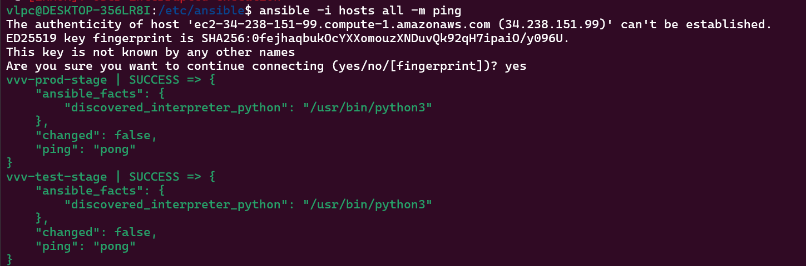

# Практическая работа №4
### Часть 1
1) [Инвентори-файл](src/hosts)
2) ```ansible -i hosts all -m ping```  

3) playbooks  
3.1 [install_nginx](src/install_nginx.yml)  
3.2 [deploy_website.yml](src/deploy_website.yml)  
3.3 [install_postgres.yml](src/install_postgres.yml)  
### Часть 2
* Создаем таблицы и делаем выборку:
```SQL
create table CITIES
(
    ID         NUMBER generated as identity primary key,
    NAME       VARCHAR2(100) not null,
    POPULATION NUMBER        not null
);

create table CITIZENS
(
    ID      NUMBER generated as identity primary key,
    NAME    VARCHAR2(100) not null,
    AGE     NUMBER        not null,
    CITY_ID NUMBER
);
```
```SQL
select * from CITIES
join citizens c2 on CITIES.ID = c2.CITY_ID
```


* Инструкция по запуску приложения:
1) Прежде чем запускать контейнеры, удостоверьтесь, что у вас установлен  
Oracle Instant Client, так как он необходим для подключения к oracle db. Скачать можно по ссылке:
   https://www.oracle.com/database/technologies/instant-client/downloads.html 
Необходимо установить Basic Package и SDK Package. 
2) Проверьте, что все было корректно установленно:
```Bash
RUN ls /opt/oracle/instantclient_23_4
RUN echo $LD_LIBRARY_PATH
RUN echo $PATH
```
3) Если необходимо, скорректируйте Dockerfile и docker-compose, чтобы версии совпадали.
4) Запустите контейнеры  
Сначала запустите oracle db и проверьте, что база корректно запустилась.
```Bash
docker-compose up oradb -d
```
После можно запускать сам сервис.  
```Bash
docker-compose up city-service -d
```
* Описание работы приложения:
```
request:
curl --request GET \
  --url http://localhost:8001/cities/id/21
  
response:
{
	"ID": 21,
	"Name": "dushanbe",
	"Population": 900000
}
```
```
request:
curl --request POST \
  --url 'http://localhost:8001/cities?name=Ekaterinburg&population=1536183'
  
response:
 41
```
```
request:
curl --request GET \
  --url http://localhost:8001/cities/all
  
response:
 [
	{
		"ID": 21,
		"Name": "dushanbe",
		"Population": 900000
	},
	{
		"ID": 41,
		"Name": "Ekaterinburg",
		"Population": 1536183
	}
]
```
```
request:
curl --request PUT \
  --url 'http://localhost:8001/cities/id/21?name=dushanbe&population=863400'
```